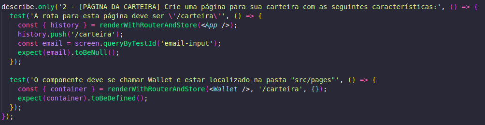
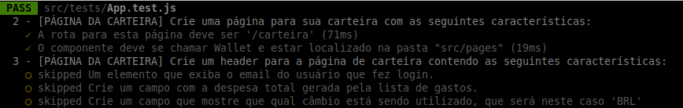
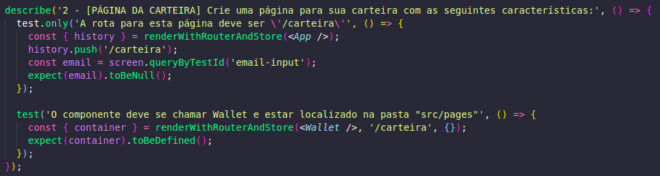
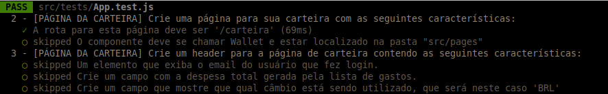
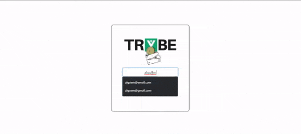
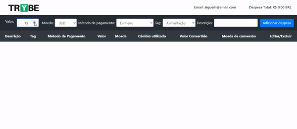
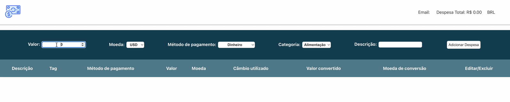
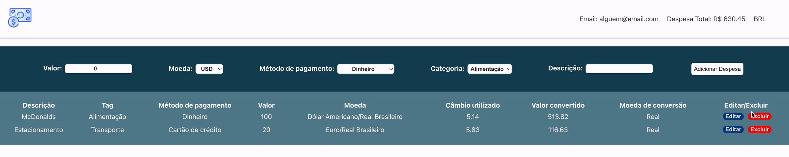
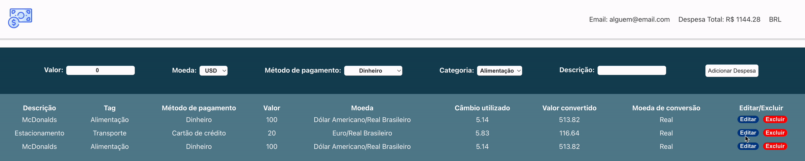

### Termos e acordos

Ao iniciar este projeto, você concorda com as diretrizes do Código de Ética e Conduta e do Manual da Pessoa Estudante da Trybe.

---

# Boas vindas ao repositório do projeto Trybe Wallet

Você já usa o GitHub diariamente para desenvolver os exercícios, certo? Agora, para desenvolver os projetos, você deverá seguir as instruções a seguir. Fique atento a cada passo, e se tiver qualquer dúvida, nos envie por _Slack_! #vqv 🚀

Aqui você vai encontrar os detalhes de como estruturar o desenvolvimento do seu projeto a partir deste repositório, utilizando uma branch específica e um _Pull Request_ para colocar seus códigos.

---

# Sumário

- [Boas vindas ao repositório do projeto Trybe Wallet!](#boas-vindas-ao-repositório-do-projeto-trybe-wallet)
- [Sumário](#sumário)
- [Habilidades](#habilidades)
- [Entregáveis](#entregáveis)
  - [O que deverá ser desenvolvido](#o-que-deverá-ser-desenvolvido)
  - [Desenvolvimento](#desenvolvimento)
  - [Data de Entrega](#data-de-entrega)
- [Instruções para entregar seu projeto](#instruções-para-entregar-seu-projeto)
  - [Antes de começar a desenvolver](#antes-de-começar-a-desenvolver)
  - [Durante o desenvolvimento](#durante-o-desenvolvimento)
  - [Depois de terminar o desenvolvimento (opcional)](#depois-de-terminar-o-desenvolvimento-opcional)
- [Como desenvolver](#como-desenvolver)
  - [Linter](#linter)
  - [Configurando o Redux DevTools](#configurando-o-redux-devtools)
  - [Documentação da API de Cotações de Moedas](#documentação-da-api-de-cotações-de-moedas)
  - [Execução de testes unitários](#execução-de-testes-unitários)
- [Requisitos do projeto](#requisitos-do-projeto)
  - [Lista de requisitos](#lista-de-requisitos)
    - [Página de Login](#página-de-login)
      - [1. Crie uma página inicial de login com os seguintes campos e características:](#1-crie-uma-página-inicial-de-login-com-os-seguintes-campos-e-características)
    - [Página da Carteira](#página-da-carteira)
    - [Configurando sua página](#configurando-sua-página)
      - [2. Crie uma página para sua carteira com as seguintes características:](#2-crie-uma-página-para-sua-carteira-com-as-seguintes-características)
    - [Header](#header)
      - [3. Crie um header para a página de carteira contendo as seguintes características:](#3-crie-um-header-para-a-página-de-carteira-contendo-as-seguintes-características)
    - [Formulário de adição de Despesa](#formulário-de-adição-de-despesa)
      - [4. Implemente a lógica para armazenar no estado global as siglas das moedas que vêm da API:](#4-Implemente-a-lógica-para-armazenar-no-estado-global-as-siglas-das-moedas-que-vêm-da-api)
      - [5. Desenvolva um formulário para adicionar uma despesa contendo as seguintes características:](#5-desenvolva-um-formulário-para-adicionar-uma-despesa-contendo-as-seguintes-características)
      - [6. Salve todas as informações do formulário no estado global:](#6-salve-todas-as-informações-do-formulário-no-estado-global)
    - [Tabela de Gastos](#tabela-de-gastos)
      - [7. Desenvolva uma tabela com os gastos contendo as seguintes características:](#7-desenvolva-uma-tabela-com-os-gastos-contendo-as-seguintes-características)
      - [8. Implemente a lógica para que a tabela seja alimentada pelo estado da aplicação](#8-implemente-a-lógica-para-que-a-tabela-seja-alimentada-pelo-estado-da-aplicação)
      - [9. Crie um botão para deletar uma despesa da tabela contendo as seguintes características:](#9-crie-um-botão-para-deletar-uma-despesa-da-tabela-contendo-as-seguintes-características)
      - [10. Crie um botão para editar uma despesa da tabela contendo as seguintes características:](#10-crie-um-botão-para-editar-uma-despesa-da-tabela-contendo-as-seguintes-características)
- [Avisos Finais](#avisos-finais)

---

# Habilidades

Neste projeto, verificamos se voce é capaz de:

- Criar um store Redux em aplicações React

- Criar reducers no Redux em aplicações React

- Criar actions no Redux em aplicações React

- Criar dispatchers no Redux em aplicações React

- Conectar Redux aos componentes React

- Criar actions assíncronas na sua aplicação React que faz uso de Redux.

---

# Entregáveis

## O que deverá ser desenvolvido

Neste projeto você vai desenvolver uma carteira de controle de gastos com conversor de moedas, ao utilizar essa aplicação um usuário deverá ser capaz de:

- Adicionar, remover e editar um gasto;
- Visualizar uma tabelas com seus gastos;
- Visualizar o total de gastos convertidos para uma moeda de escolha;

Para entregar o seu projeto você deverá criar um Pull Request neste repositório.

Lembre-se que você pode consultar nosso conteúdo sobre Git & GitHub no Course sempre que precisar!

## Desenvolvimento

Você deve desenvolver uma aplicação em React que use Redux como ferramenta de manipulação de estado.

Através dessa aplicação, será possível realizar as operações básicas de criação e manipulação de um estado de redux.

## Data de Entrega

- Projeto individual.

- Serão dois dias de projeto.
- Data de entrega para avaliação final do projeto: `DD/MM/YYYY - 14:00h`.

---

# Instruções para entregar seu projeto

## Antes de começar a desenvolver

1. Clone o repositório

- `git clone git@github.com:tryber/sd-0x-project-trybewallet.git`
- Entre na pasta do repositório que você acabou de clonar:
  - `cd sd-0x-project-trybewallet`

2. Instale as dependências e inicialize o projeto

- Instale as dependências:
  - `npm install`
- Inicialize o projeto:
  - `npm start` (uma nova página deve abrir no seu navegador com um texto simples)
- Verifique que os testes estão executando:
  - `npm test` (os testes devem rodar e falhar)

3. Crie uma branch a partir da branch `master`

- Verifique que você está na branch `master`
  - Exemplo: `git branch`
- Se não estiver, mude para a branch `master`
  - Exemplo: `git checkout master`
- Agora, crie uma branch onde você vai guardar os commits do seu projeto

---

## Durante o desenvolvimento

- Faça `commits` das alterações que você fizer no código regularmente

- Lembre-se de sempre após um (ou alguns) `commits` atualizar o repositório remoto

- Os comandos que você utilizará com mais frequência são:
  1. `git status` _(para verificar o que está em vermelho - fora do stage - e o que está em verde - no stage)_
  2. `git add` _(para adicionar arquivos ao stage do Git)_
  3. `git commit` _(para criar um commit com os arquivos que estão no stage do Git)_
  4. `git push -u origin nome-da-branch` _(para enviar o commit para o repositório remoto na primeira vez que fizer o `push` de uma nova branch)_
  5. `git push` _(para enviar o commit para o repositório remoto após o passo anterior)_

---

## Depois de terminar o desenvolvimento (opcional)

Para **"entregar"** seu projeto, siga os passos a seguir:

- Vá até a página **DO SEU** _Pull Request_, adicione a label de _"code-review"_ e marque seus colegas
  - No menu à direita, clique no _link_ **"Labels"** e escolha a _label_ **code-review**
  - No menu à direita, clique no _link_ **"Assignees"** e escolha **o seu usuário**
  - No menu à direita, clique no _link_ **"Reviewers"** e digite `students`, selecione o time `tryber/students-sd-00`

---

# Como desenvolver

Nessa aplicação você deverá **obrigatoriamente** utilizar o seguinte formato do estado global:

```
{
  user: {
    email: '',
  },
  wallet: {
    currencies: [],
    expenses: []
  }
}
```

É importante respeitar esse formato para que o avaliador funcione corretamente. Você pode adicionar novos campos ao seu estado global, mas essa estrutura básica deve se manter. Por exemplo, você pode adicionar uma propriedade `isFetching` no seu estado. Mas você **não** pode salvar as despesas em uma chave diferente de `wallet.expenses`.

**Observações Importantes:**

- Devido a estrutura que o avaliador utiliza para realizar os testes, é necessário que o seu Redux esteja configurado, ou seja, a store e os reducers estejam criados e conectados.
- É necessário que o `<Provider />` e o seu `<BrowserRouter />` estejam no arquivo index.js e não no `<App />`.
- Também será necessário a instalação da biblioteca PropTypes utilizando o comando `npm install prop-types`.

## Linter

Para garantir a qualidade do código, vamos utilizar neste projeto o linter ESLint. Assim o código estará alinhado com as boas práticas de desenvolvimento, sendo mais legível e de fácil manutenção! Para rodar o _linter_ localmente no projeto, execute o comando abaixo:

`npm run lint`

⚠ PULL REQUESTS COM ISSUES DE LINTER NÃO SERÃO AVALIADAS. ATENTE-SE PARA RESOLVÊ-LAS ANTES DE FINALIZAR O DESENVOLVIMENTO! ⚠

Aqui encontram-se os requisitos do projeto. Em cada requisito você encontrara uma imagem de um protótipo de como sua aplicação deve ficar. Estilo da página não será avaliado.

---

## Configurando o Redux DevTools

Pra usarmos o Redux DevTools com o Redux-Thunk, vamos utilizar uma biblioteca chamada `composeWithDevTools`, ela já está no package.json, a única coisa que você vai precisar fazer é configurar a sua store, por exemplo:

```
import { createStore, applyMiddleware } from 'redux';
import { composeWithDevTools } from 'redux-devtools-extension';
import thunk from 'redux-thunk';
import reducer from '../reducers';

const store = createStore(
  reducer,
  composeWithDevTools(
    applyMiddleware(thunk),
  ),
);

export default store;
```

---

## Documentação da API de Cotações de Moedas

Sua página _web_ irá consumir os dados da API do _awesomeapi API de Cotações_ para realizar a busca de câmbio de moedas. Para realizar essas buscas, vocês precisarão consultar o seguinte _endpoint_:

- <https://economia.awesomeapi.com.br/json/all>

O retorno desse endpoint será algo no formato:

```
{
   {
     "USD": {
       "code":"USD",
       "codein":"BRL",
       "name":"Dólar Americano/Real Brasileiro",
       "high":"5.6689",
       "low":"5.6071",
       "varBid":"-0.0166",
       "pctChange":"-0.29",
       "bid":"5.6173",
       "ask":"5.6183",
       "timestamp":"1601476370",
       "create_date":"2020-09-30 11:32:53"
       },
      ...
   }
}
```

Se você quiser aprender mais informações sobre a API, veja a [documentação](https://docs.awesomeapi.com.br/api-de-moedas).

---

## Execução de testes unitários

Vamos utilizar [React Testing Library](https://testing-library.com/docs/react-testing-library/intro) para execução dos testes unitários.

Esse _framework_ de testes utiliza algumas marcações no código para verificar a solução proposta, uma dessas marcações é o atributo `data-testid` e faremos uso dele aqui.

Na descrição dos requisitos (logo abaixo) será pedido que seja feita a adição de atributos `data-testid` nos elementos _HTML_. Vamos a um exemplo para deixar claro essa configuração:

Se o requisito pedir "crie um botão e adicione o id de teste (ou `data-testid`) com o valor `my-action`, você pode criar:

```html
<button data-testid="my-action"></button>
```

ou

```html
<a data-testid="my-action"><a /></a>
```

ou seja, o atributo `data-testid="my-action"` servirá para o React Testing Library(RTL) identificar o elemento e dessa forma, conseguiremos realizar testes unitários focados no comportamento da aplicação.

Em alguns requisitos, utilizamos o `getByRole` para poder selecionar os elementos de forma semântica. Portanto atente-se às instruções de cada requisito. Por exemplo, se o requisito pedir explicitamente um `button`, você deverá utilizar exatamente esse elemento.

Afim de verificar a solução proposta, você pode executar todos os testes unitários localmente, basta executar:

```bash
npm test
```

### Dica: desativando testes

Para rodar apenas um teste, basta a utilização da função `.only` após o describe. Com isso, será possível que apenas um requisito rode localmente e seja avaliado.




Caso queira avaliar apenas um tópico do requisito, você também pode usar o `.only` após o `test`.




---

# Requisitos do projeto

:warning: **PULL REQUESTS COM ISSUES DE LINTER NÃO SERÃO AVALIADAS.** :warning:

:warning: **Os gifs são meramente ilustrativos para visualizar o fluxo da aplicação, os nomes devem seguir os requisitos e não o gif.** :warning:

:warning: **Obs: Lembre-se de olhar a seção [Como desenvolver](#como-desenvolver) para entender como configurar a aplicação para desenvolver os requisitos.** :warning:

## Lista de requisitos

### Página de Login

Crie uma página para que a pessoa usuária se identifique, com email e senha. Esta página deve ser a página inicial de seu aplicativo.



#### 1. Crie uma página inicial de login com os seguintes campos e características

- A rota para esta página deve ser ‘/’.

- Você deve criar um local para que a pessoa usuária insira seu email e senha. Utilize o atributo `data-testid="email-input"` para o email e `data-testid="password-input"` para a senha.

- Crie um botão com o texto ‘Entrar’.

- Realize as seguintes verificações nos campos de email e senha, de modo que caso sejam falsas o botão fique desabilitado:

  - O email está no formato válido, como 'alguem@alguem.com'.

  - A senha possui 6 ou mais caracteres.

- Salve o email no estado da aplicação, com a chave **_email_**, assim que a pessoa usuária logar.

- A rota deve ser mudada para '/carteira' após o clique no botão '**Entrar**'.

  **O que será verificado:**

- A rota para esta página deve ser "/"
- Crie um local para que o usuário insira seu email e senha
- Crie um botão com o texto "Entrar"
- Realize as seguintes verificações nos campos de email, senha e botão:
- Se é um e-mail no formato válido;
- Se a senha tem 6 ou mais caracteres;
- Desabilitar o botão `Entrar` caso e-mail e/ou senha estiverem no formato inválido
- Habilitar o botão `Entrar` caso e-mail e senha sejam válidos
- Salve o email no estado da aplicação, com a chave email, assim que o usuário logar
- A rota deve ser mudada para "/carteira" após o clique no botão

### Página da Carteira

Crie uma página para gerenciar a carteira de gastos em diversas moedas, e que traga a despesa total em real que é representado pelo código 'BRL'. Esta página deve ser renderizada por um componente chamado **_Wallet_**.



### Configurando sua página

#### 2. Crie uma página para sua carteira com as seguintes características

- A rota para esta página deve ser `/carteira`

- O componente deve se chamar Wallet e estar localizado na pasta `src/pages` no arquivo `Wallet.js`

  **O que será verificado:**

- A rota para esta página deve ser "/carteira"
- O componente deve se chamar Wallet e estar localizado na pasta "src/pages"

### Header

#### 3. Crie um header para a página de carteira contendo as seguintes características

- Um elemento que exiba o email da pessoa usuária que fez login.

  - Adicione o atributo `data-testid="email-field"`.

  ```
  Dica: você deve pegar o email do estado global da aplicação (no Redux)
  ```

- Um elemento com a despesa total gerada pela lista de gastos.

  - Adicione o atributo `data-testid="total-field"`.

  - Inicialmente esse elemento deve exibir o valor `0`

- Um elemento que mostre qual câmbio está sendo utilizado, que será neste caso será 'BRL'.

  - Adicione o atributo `data-testid="header-currency-field"`.

**O que será verificado:**

- Um elemento que exiba o email do usuário que fez login.
- Crie um elemento com a despesa total gerada pela lista de gastos.
- Crie um elemento que mostre que qual câmbio está sendo utilizado, que será neste caso "BRL"

### Formulário de adição de Despesa

#### 4. Implemente a lógica para armazenar no estado global as siglas das moedas que vêm da API

  * Os valores da chave `currencies` no estado global devem ser puxados através de uma requisição à API, que deve ser feita ao entrar na página `/carteira`, sendo representado pela sigla de cada moeda, exemplo: 'USD', 'CAD', 'EUR'...

    * O endpoint utilizado deve ser: https://economia.awesomeapi.com.br/json/all

    * Remova das informações trazidas pela API a opção 'USDT' (Moeda Tether).

    * A chave `currencies` do estado global deve ser um array.

**O que será verificado:**

  - O valor da chave `currencies` no estado global é um array que possui as siglas das moedas que vieram da API

#### 5. Desenvolva um formulário para adicionar uma despesa contendo as seguintes características:



- Um campo para adicionar valor da despesa.

  - Adicione o atributo `data-testid="value-input"`.

- Um campo para adicionar a descrição da despesa.

  - Adicione o atributo `data-testid="description-input"`.
    
- Um campo para selecionar em qual moeda será registrada a despesa.

  - O campo deve ter a label `Moeda`.

  - As options devem ser preenchidas pelo valor da chave `currencies` do estado global, implementada no requisito anterior.

  - O campo deve ser um `<select>`.

- Um campo para adicionar qual método de pagamento será utilizado.

  - Adicione o atributo `data-testid="method-input"`.

  - Este campo deve ser um `<select>`. A pessoa usuária deve poder escolher entre os campos: 'Dinheiro', 'Cartão de crédito' e 'Cartão de débito'.

- Um campo para selecionar uma categoria (tag) para a despesa.

  - Este campo deve ser um dropdown. a pessoa usuária deve poder escolher entre os campos: 'Alimentação', 'Lazer', 'Trabalho', 'Transporte' e 'Saúde'.

  - O campo deve ser um `<select>`.

**O que será verificado:**

  - Um campo para adicionar o valor da despesa
  - Um campo para adicionar a descrição da despesa
  - Um campo para selecionar em qual moeda será registrada a despesa
  - Um campo para selecionar qual método de pagamento será utilizado
  - Um campo para selecionar uma categoria (tag) para a despesa

#### 6. Salve todas as informações do formulário no estado global

  * Crie um botão com o texto \'Adicionar despesa\' que salva as informações da despesa no estado global e atualiza a soma de despesas no header.

  - Desenvolva a funcionalidade do botão "Adicionar despesa" de modo que ao clicar no botão, as seguintes ações sejam executadas:

  - Os valores dos campos devem ser salvos no estado da aplicação, na chave **_expenses_**, dentro de um array contendo todos gastos que serão adicionados:

    - O `id` da despesa **deve** ser um número sequencial, começando em 0. Ou seja: a primeira despesa terá id 0, a segunda terá id 1, a terceira id 2, e assim por diante.

    - Você deverá salvar a cotação do câmbio feita no momento da adição para ter esse dado quando for efetuar uma edição do gasto. Caso você não tenha essa informação salva, o valor da cotação trazida poderá ser diferente do obtido anteriormente.

    ```
    Atenção nesse ponto: você deverá fazer uma requisição para API e buscar a cotação no momento que o botão de `Adicionar despesa` for apertado. Para isso você deve utilizar um thunk
    ```

  - Após adicionar a despesa, atualize a soma total das despesas (utilize a chave `ask` para realizar essa soma). Essa informação deve ficar no header dentro do elemento com `data-testid="total-field"`

  - Após adicionar a despesa, limpe o valor do campo `valor da despesa`

    As despesas salvas no Redux ficarão com um formato semelhante ao seguinte:

    ```
    expenses: [{
      "id": 0,
      "value": "3",
      "description": "Hot Dog",
      "currency": "USD",
      "method": "Dinheiro",
      "tag": "Alimentação",
      "exchangeRates": {
        "USD": {
          "code": "USD",
          "name": "Dólar Comercial",
          "ask": "5.6208",
          ...
        },
        "CAD": {
          "code": "CAD",
          "name": "Dólar Canadense",
          "ask": "4.2313",
          ...
        },
        "EUR": {
          "code": "EUR",
          "name": "Euro",
          "ask": "6.6112",
          ...
        },
        "GBP": {
          "code": "GBP",
          "name": "Libra Esterlina",
          "ask": "7.2498",
          ...
        },
        "ARS": {
          "code": "ARS",
          "name": "Peso Argentino",
          "ask": "0.0729",
          ...
        },
        "BTC": {
          "code": "BTC",
          "name": "Bitcoin",
          "ask": "60299",
          ...
        },
        "LTC": {
          "code": "LTC",
          "name": "Litecoin",
          "ask": "261.69",
          ...
        },
        "JPY": {
          "code": "JPY",
          "name": "Iene Japonês",
          "ask": "0.05301",
          ...
        },
        "CHF": {
          "code": "CHF",
          "name": "Franco Suíço",
          "ask": "6.1297",
          ...
        },
        "AUD": {
          "code": "AUD",
          "name": "Dólar Australiano",
          "ask": "4.0124",
          ...
        },
        "CNY": {
          "code": "CNY",
          "name": "Yuan Chinês",
          "ask": "0.8278",
          ...
        },
        "ILS": {
          "code": "ILS",
          "name": "Novo Shekel Israelense",
          "ask": "1.6514",
          ...
        },
        "ETH": {
          "code": "ETH",
          "name": "Ethereum",
          "ask": "5184",
          ...
        },
        "XRP": {
          "code": "XRP",
          "name": "Ripple",
          "ask": "1.4",
          ...
        }
      }
    }]
    ```

**O que será verificado:**

  - Um botão com o texto "Adicionar despesa" que salva as informações da despesa no estado global e atualiza a soma de despesas no header

### Tabela de Gastos

#### 7. Desenvolva uma tabela com os gastos contendo as seguintes características:

**O que será verificado:**

- A tabela deve possuir um cabeçalho com os campos `Descrição`, `Tag`, `Método de pagamento`, `Valor`, `Moeda`, `Câmbio utilizado`, `Valor convertido`, `Moeda de conversão` e `Editar/Excluir`.

#### 8. Implemente a lógica para que a tabela seja alimentada pelo estado da aplicação

- A tabela deve ser alimentada pelo estado da aplicação, que estará disponível na chave **_expenses_** que vem do reducer `wallet`.

  - O campo de Moeda e Moeda de Conversão deverão conter o nome da moeda. Portanto, ao invés de 'USD' ou 'EUR', deve conter "Dólar Comercial" e "Euro", respectivamente

  - Por padrão, o elemento que exibe a 'Moeda de conversão' deverá ser sempre 'Real'.

  - Atenção também às casas decimais dos campos. Como são valores contábeis, eles devem apresentar duas casas após a vírgula. Arredonde sua resposta somente na hora de renderizar o resultado, e para os cálculos utilize sempre os valores vindos da API (utilize o campo `ask` que vem da API).

  - Utilize sempre o formato `0.00` (número - ponto - duas casas decimais)

  **O que será verificado:**

  - A tabela deve ser alimentada pelo estado da aplicação, que estará disponível na chave expenses que vem do reducer wallet.

#### 9. Crie um botão para deletar uma despesa da tabela contendo as seguintes características:



- O botão deve ser o último item da linha da tabela e deve possuir `data-testid="delete-btn"`.

- Ao ser clicado, o botão deleta a linha da tabela, alterando o estado global e o header.

**O que será verificado:**

- O botão deve estar dentro do último item da linha da tabela e deve possuir `data-testid="delete-btn"`
- Ao ser clicado, o botão deleta a linha da tabela, alterando o estado global
- Ao clicar no botão para remover uma despesa, o valor correspondente deve ser subtraído e a despesa total deve ser atualizada no header

#### 10. Crie um botão para editar uma despesa da tabela contendo as seguintes características:



- O botão deve estar dentro do último item da linha da tabela e deve possuir `data-testid="edit-btn"`

- Ao ser clicado, o botão habilita um formulário para editar a linha da tabela. Ao clicar em "Editar despesa" ela é atualizada, alterando o estado global.

  - O formulário deverá ter os mesmos `data-testid` do formulário de adicionar despesa. Você pode reaproveitá-lo.

  - O botão para submeter a despesa para edição deverá conter **exatamente** o texto "Editar despesa"

  - Após a edição da despesa, a ordem das despesas na tabela precisa ser mantida.

  - Obs: para esse requisito, não é necessário popular os inputs com os valores prévios da despesa. A imagem do gif é apenas uma sugestão. 

    **Atenção**: o câmbio utilizado na edição deve ser o mesmo do cálculo feito na adição do gasto.

**O que será verificado:**

- O botão deve estar dentro do último item da linha da tabela e deve possuir `data-testid="edit-btn"
- Ao ser clicado, o botão habilita um formulário para editar a linha da tabela. Ao clicar em "Editar despesa" ela é atualizada, alterando o estado global

---

## Depois de terminar o desenvolvimento

Para **"entregar"** seu projeto, siga os passos a seguir:

- Vá até a página **DO SEU** _Pull Request_, adicione a label de _"code-review"_ e marque seus colegas
  - No menu à direita, clique no _link_ **"Labels"** e escolha a _label_ **code-review**
  - No menu à direita, clique no _link_ **"Assignees"** e escolha **o seu usuário**
  - No menu à direita, clique no _link_ **"Reviewers"** e digite `students`, selecione o time `tryber/students-sd-00`

Se ainda houver alguma dúvida sobre como entregar seu projeto, [aqui tem um video explicativo](https://vimeo.com/362189205).

⚠ Lembre-se que garantir que todas as _issues_ comentadas pelo **Lint** estão resolvidas! ⚠

---

### Revisando um pull request

À medida que você e as outras pessoas que estudam na Trybe forem entregando os projetos, vocês receberão um alerta via Slack para também fazer a revisão dos Pull Requests dos seus colegas. Fiquem atentos às mensagens do "Pull Reminders" no Slack!

Use o material que você já viu sobre [Code Review](https://course.betrybe.com/real-life-engineer/code-review/) para te ajudar a revisar os projetos que chegaram para você.

---

# Avisos Finais

Ao finalizar e submeter o projeto, não se esqueça de avaliar sua experiência preenchendo o formulário. Leva menos de 3 minutos!

Link: [FORMULÁRIO DE AVALIAÇÃO DE PROJETO](https://bit.ly/2OfLJPn)

O avaliador automático não necessariamente avalia seu projeto na ordem em que os requisitos aparecem no readme. Isso acontece para deixar o processo de avaliação mais rápido. Então, não se assuste se isso acontecer, ok?

---
